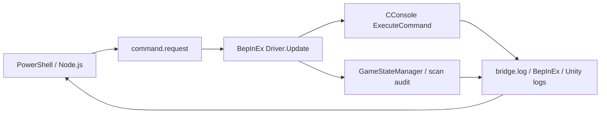

# CLIからGTFO内のコマンドを実行する仕組み

`AnarchyValidation.dll` をBepInExがゲーム内へ読み込み、Node.jsが書いたコマンドファイルを受け取ります。ゲームの画面・キー・マウスを操作する必要はありません。GTFO.exeは通常起動し、ゲームウィンドウと描画処理は存在します。

このディレクトリには、Anarchy 1.1.6の検証に使ったプラグインと制御スクリプトを、パスを指定して再実行できる形で収録しています。



## ゲーム内で行う処理

1. BepInExのIL2CPPプラグインとして `Plugin.cs` を読み込み、`Driver` をUnityのコンポーネントに登録します。`Application.runInBackground = true` により、ゲームが最前面にない間も受信処理を動かします。
2. `Driver.Update()` がUnityのメインスレッドで0.5秒ごとに `command.request` を調べます。ファイルを `command.accepted` へ移してから、1行のコマンドを処理します。
3. `LoadExpedition 3 2` や `God true` は、CConsoleの `CustomCmdContext.ExecuteCommand()` に渡します。CConsole 0.14.0のコンテキスト生成には非公開コンストラクターへのreflectionを使っています。別バージョンに変更する際は、この生成部分も検証が必要です。
4. `build` はこの検査プラグイン独自のコマンドです。Lobby状態で `GameStateManager.CurrentState.TryStartLevelTrigger()` を呼び、実際のレベル生成を開始します。`audit` も独自コマンドで、生成されたスキャン本体とNavMesh、読み込まれた霧データを検査します。
5. 状態変化・受信・検査結果を `bridge.log` とBepInExのログに出力し、CLI側が読み取ります。

コマンドファイルは、一時ファイルを書き終えてから同じディレクトリ内にハードリンクを作り、`command.request` として公開します。これにより、書きかけのコマンドをゲームが読むことを防ぎます。既にコマンドが待機していれば上書きせず失敗します。ログ置き場にはローカルのNTFSディレクトリを使用してください。

**`ACCEPTED` は受信の確認です。コマンドが成功したことまでは意味しません。** CConsoleへ渡した後は `DISPATCHED`、生成開始は `START_RESULT True`、生成後は `STATE InLevel`、検査完了は `AUDIT_DONE C2` などで確認します。CConsole内部のエラーはBepInExログも確認します。`FAIL` は検査プラグイン側の例外です。

## 準備

- Windows、Node.js 18以降、.NET 6をターゲットにビルドできる.NET SDK、PowerShell 7。
- Steam認証が済み、起動可能なGTFOのテスト用コピー。1.1.6の検証はrevision 34873を使用しました。
- テスト用コピーにBepInExPack_GTFO 3.2.2、Anarchyとその依存MOD、追加の [CConsole 0.14.0](https://thunderstore.io/c/gtfo/p/GTFOModding/CConsole/0.14.0/) を導入します。依存バージョンは [runtime-dependencies.json](../runtime-dependencies.json) に記録しています。
- BepInExを導入したゲームを一度起動して終了し、`BepInEx/interop` を生成しておきます。

フォルダの例です。ログはローカルに保存され、同じステージを再実行するとそのステージのログを更新します。

```text
C:/gtfo-anarchy-test/
  runtime/
    GTFO.exe
    GTFO_Data/
    BepInEx/
      core/
      interop/
      plugins/
        Anarchy/                 # GameData、Custom、PartialData
        GTFOModding-CConsole/CConsole.dll
        ScanPosOverride.dll
        AnarchyValidation.dll    # 次の手順で作成
  logs/                          # 自動作成
```

ゲームを終了した状態で、リポジトリのルートから実行します。

```powershell
$testRoot = 'C:\gtfo-anarchy-test'
$gameRoot = Join-Path $testRoot 'runtime'
dotnet build tools/game-validation/bridge/AnarchyValidation.csproj -c Release "-p:GameRoot=$gameRoot"
if ($LASTEXITCODE -ne 0) { throw 'Bridge build failed' }
Copy-Item -LiteralPath 'tools/game-validation/bridge/bin/Release/net6.0/AnarchyValidation.dll' -Destination (Join-Path $gameRoot 'BepInEx/plugins/AnarchyValidation.dll')
```

CConsoleやScanPosOverrideのDLLを別の場所に置いた場合は、ビルド時に `-p:CConsolePath=...`、`-p:ScanOverridePath=...` を指定できます。これらのDLLやゲームのinterop DLLはリポジトリに同梱していません。

`BepInEx/config/BepInEx.cfg` の `[Logging.Disk]` は次の設定で検証しました。Unityのエラーも同じログで確認できるようにします。

```ini
[Logging.Disk]
Enabled = true
LogLevels = Fatal, Error, Warning, Message, Info
InstantFlushing = true
WriteUnityLog = true
```

検証時のCConsoleはFastStartupとFastElevatorを有効、Extended Freeflight Cameraを無効にしました。

```ini
[General]
Fast Startup = true
Fast Elevator on Startup = true
Enable Extended Freeflight Camera = false
```

## 全ステージを生成して検査する

```powershell
node tools/game-validation/run.cjs $testRoot 'C1,C2,D1,D2,D3'
```

各ステージについて、新しいGTFO.exeを起動し、`NoLobby → LoadExpedition → Lobby → God true → build → InLevel → audit → quit` の順で実行します。無敵は放置中の戦闘失敗を避けるためです。1つでも生成・検査に失敗すれば終了コード1になります。Errorログの件数だけで成功判定はしません。

| ステージ | CConsoleへ渡す選択コマンド |
| --- | --- |
| C1 | `LoadExpedition 2 0` |
| C2 | `LoadExpedition 2 1` |
| D1 | `LoadExpedition 3 0` |
| D2 | `LoadExpedition 3 1` |
| D3 | `LoadExpedition 3 2` |

`audit` はC2・D1・D2・D3の設定ファイルを読み、指定Indexのスキャン本体が存在すること、座標の差とNavMeshとの距離がそれぞれ0.2m以内であることを検査します。霧ID 225の名称と感染率0.05も確認します。C1には固定スキャン設定がありません。1.1.6の実測では19か所すべてが床から0.1m未満でした。

C1の入口を開き、ZONE63へ移動して70秒観察する追加検査は次のコマンドです。入口スキャンを通常プレイでクリアする検査とは区別しています。

```powershell
node tools/game-validation/run.cjs $testRoot 'C1' --advance-c1
```

`logs/<stage>-inputs.json` に入力データのSHA-256、`-startup.log` に起動ログ、`-build.log` に生成から検査までのBepInExログ、`-player.log` にUnityログ、`-bridge.log` に状態・検査結果、`-result.json` に成功/失敗と集計を保存します。

## 1コマンドずつ送る

自動検査と手動送信を同じログディレクトリで同時に実行しないでください。手動送信時は、ゲームを次のように起動します。

```powershell
$env:ANARCHY_VALIDATION_LOGS = Join-Path $testRoot 'logs'
$env:ANARCHY_MOD_ROOT = Join-Path $gameRoot 'BepInEx/plugins/Anarchy'
Start-Process -FilePath (Join-Path $gameRoot 'GTFO.exe') -WorkingDirectory $gameRoot -WindowStyle Hidden
```

ログで `NoLobby` を確認してからステージを選択し、`Lobby` を確認してから生成を開始します。別のCLIからログを追尾できます。

```powershell
Get-Content -LiteralPath (Join-Path $testRoot 'logs/bridge.log') -Wait -Tail 20
```

```powershell
node tools/game-validation/command.cjs "$testRoot/logs" 'status'
node tools/game-validation/command.cjs "$testRoot/logs" 'LoadExpedition 3 2'
# STATE Lobby を確認
node tools/game-validation/command.cjs "$testRoot/logs" 'God true'
node tools/game-validation/command.cjs "$testRoot/logs" 'build'
# STATE InLevel を確認
node tools/game-validation/command.cjs "$testRoot/logs" 'audit D3'
node tools/game-validation/command.cjs "$testRoot/logs" 'quit'
```

ログの既定位置はゲームディレクトリの隣の `logs`、MODデータの既定位置は `BepInEx/plugins/Anarchy` です。上記の環境変数で変更できます。自動検査はこれらを起動する子プロセスに設定します。

タイムアウト時は `command.request` を残します。ゲームが後から受信する可能性があるため、ゲームとログを確認してから再開してください。コントローラーが終了処理で強制終了する対象は、その実行で起動したGTFOプロセスです。

## 結果の読み方

ゲームが生成できることと、全目標をクリアできることは別の検査です。動的イベントの全経路、チェックポイント、途中参加、マルチプレイ同期はこのツールだけでは検証できません。残るエラーログの分類と1.1.6の結果は [VALIDATION.md](../../VALIDATION.md) を参照してください。

2026-09-07に、このリポジトリ版をコンパイルし、C2を新規プロセスで生成して `InLevel` と4か所のスキャン検査成功を確認しました。ファイル経由のコマンド受信、結果のログ保存、終了処理まで実機で実行しています。

生ログにはSteamのアカウント・セッション情報が含まれます。公開用には集計結果を使っています。この検査用DLL、CConsole、ログは `tools/package-release.ps1` の配布ZIP対象には含まれません。
